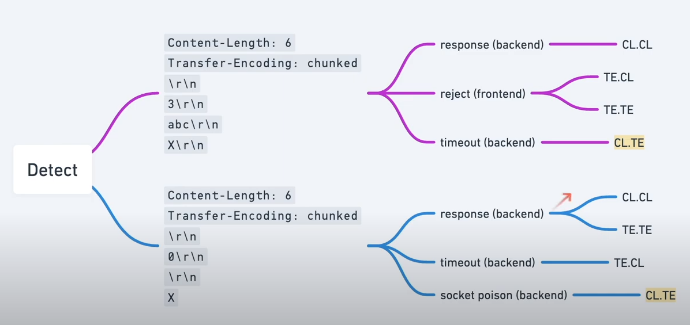
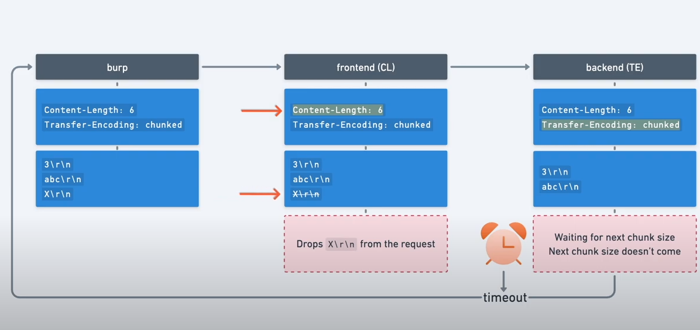

## Definition

http smuggling attack is a way for interfering with the way a website processes a sequence of http requests, allowing an attacker to have some privileged access.

## how does it arise ?

Most http/1 have a specification to specify where the request ends.
`Content-length` and `Transfer-Encoding`.
The content length tells the length of the message's body example 

    POST /search HTTP/1.1
    Host: normal-website.com
    Content-Type: application/x-www-form-urlencoded
    Content-Length: 11

    q=smuggling

Whereas the Transfer encoding header is used to specify that the message body uses chunked encoding  This means that the message body contains one or more chunks of data Each chunk consists of the chunk size in bytes (expressed in hexadecimal), followed by a newline, followed by the chunk contents. The message is terminated with a chunk of size zero. For example:

    POST /search HTTP/1.1
    Host: normal-website.com
    Content-Type: application/x-www-form-urlencoded
    Transfer-Encoding: chunked

    b
    q=smuggling
    0

## perform http smug attack

The classic attack is to provide both header in the HTTP request and try to manipulate them so that the front-end and back-end servers process the request differently.

* CL.TE: the front-end server uses the Content-Length header and the back-end server uses the Transfer-Encoding header.
* TE.CL: the front-end server uses the Transfer-Encoding header and the back-end server uses the Content-Length header.
* TE.TE: the front-end and back-end servers both support the Transfer-Encoding header, but one of the servers can be induced not to process it by obfuscating the header in some way.

Most modern browsers use HTTP/2 to prevent the attack, so it needs to be changed manually some times.

### Notes : 
Prepare burp for request smuggling

1. Downgrade to HTTP/1
2. change request method to POST
3. Disable automatic content-length
4. show non printable characters  

## Global detection 

## DETECT CL.TE vulnerability

We create this payload as the following 

    POST / HTTP/1.1
    Host: 0a6e005704daed308085a8fa008800f1.web-security-academy.net
    Connection: keep-alive
    Content-Type: application/x-www-form-urlencoded
    Content-Length: 6
    Transfer-Encoding: chunked
    \r\n
    3\r\n
    abc\r\n
    X\r\n

We set the content length to 6, to tell the front and that if it's using CL, that body should end at `abc`, and we should get a timeout after few seconds.

it' because that the front end won't be sending `X\r\n`, and looks at the chunked size equals to 3, and it'll be still waiting for the next chunked to come before the timeout.

